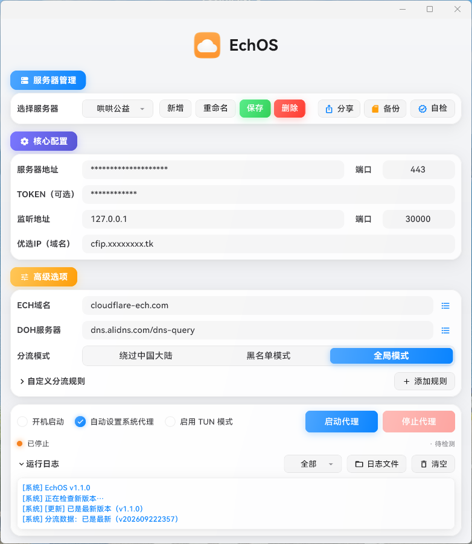
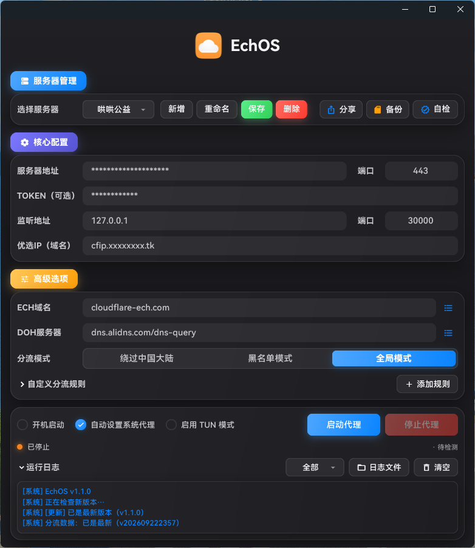

# EchOS（Windows版本）
> [EchOS For Mac](https://github.com/nerder-real/EchOS)

ECH + TLS1.3（Encrypted Client Hello）隧道代理客户端，Flutter / Windows 单平台。

本地分流（绕过中国大陆 / 黑名单 / 全局 + 自定义规则）、简易 WebSocket 协议直连、
TLS 会话复用、多入口自动重试。

## 界面预览

浅色 / 深色自动适配，跟随 Windows 系统外观自动切换，无需手动设置：

| 浅色 | 深色 |
|---|---|
|  |  |

## 项目结构

```
EchOS-Win/
├── README.md                   # 项目说明
├── build_local.ps1             # 本地一键构建（内核→Flutter→安装包→便携版）
├── pubspec.yaml                # Flutter 依赖 / 版本 / 字体声明
├── analysis_options.yaml       # lint 规则
├── worker/                     # Cloudflare Worker 服务端
│   ├── Worker-ECH.js           # 服务端完整代码（简易 WebSocket 代理）
│   ├── wrangler.toml           # Worker 配置（名称、入口）
│   └── deploy-worker.sh        # 一键部署脚本（wrangler CLI）
├── third_party/
│   ├── x-tunnel/               # Go 内核
│   │   ├── x-tunnel.go         # 入口：参数解析、端口监听、隧道调度
│   │   ├── simple_ws.go        # WebSocket 隧道（CONNECT:host:port| → CONNECTED）
│   │   ├── route_dial.go       # 分流拨号（规则命中后选直连 / 走代理）
│   │   ├── tun_geoip.go        # GeoIP 规则匹配
│   │   ├── tun_geosite.go      # Geosite 域名规则匹配
│   │   ├── tun_sniff.go        # 流量嗅探
│   │   ├── tun_direct.go       # 直连通道
│   │   ├── tun_dns.go          # DNS 处理（未启用 TUN 时交回系统解析器）
│   │   └── tun_device_windows.go / tun_physiface_windows.go / tun_stack.go
│   │                           # TUN 相关（Windows 端未启用，仅本地 HTTP/SOCKS5 代理）
│   ├── tray_manager/           # vendored 托盘插件（含 Windows C++ 实现）
│   └── menu_base/              # vendored 右键菜单插件
├── lib/                        # Flutter 客户端
│   ├── main.dart               # 入口 + 窗口/单例初始化、启动检查
│   ├── models/config.dart      # 配置模型
│   ├── services/
│   │   ├── app_state.dart      # 状态中枢：内核生命周期、更新检查、分流模式
│   │   ├── kernel_manager.dart # 内核进程管理与崩溃恢复
│   │   ├── updater.dart        # 自动更新（检查 / 下载 / 替换 / 重启）
│   │   ├── app_version.dart    # 自报版本号 + isNewer 判定
│   │   ├── config_store.dart   # 配置持久化
│   │   ├── system_proxy.dart   # 系统代理接管 / 还原
│   │   ├── tray_service.dart   # 托盘菜单与交互
│   │   ├── self_check.dart     # 连通性自检
│   │   ├── network_probe.dart  # 网络探测
│   │   ├── log_service.dart    # 日志落盘
│   │   ├── app_paths.dart      # 路径解析（含便携版 %TEMP% 判定）
│   │   ├── port_tools.dart     # 端口冲突检测与占用进程处理
│   │   ├── platform_drivers.dart  # 平台差异适配
│   │   └── share_backup.dart   # 服务器分享导出 / 导入
│   └── ui/
│       ├── home_page.dart      # 主界面
│       ├── theme.dart          # 主题与字体（HarmonyOS Sans SC 回退）
│       ├── dialogs.dart        # 通用对话框 / 更新确认框
│       ├── frosted.dart        # 毛玻璃背景组件
│       └── widgets/            # 按钮 / 下拉 / 行 / 输入框等基础控件
├── windows/                    # Windows runner（C++）
│   ├── CMakeLists.txt
│   ├── runner/                 # main.cpp / 窗口 / 资源 / 图标
│   │   └── copy_bundle.cmake   # 构建后把 bundle 内核拷进产物目录（关键钩子）
│   └── flutter/                # 插件注册与 CMake 胶水
├── assets/                     # 图标、Logo、HarmonyOS 字体（三字重共 24MB）
├── installer/                  # 打包
│   ├── EchOS.iss               # Inno Setup 安装版脚本
│   ├── portable-config.txt     # 便携版 7z SFX 配置
│   ├── ChineseSimplified.isl   # 安装界面汉化
│   └── logo.ico
├── docs/releases/v1.0.0.md     # 发版说明（自动作为 Release 正文）
├── screenshot/                 # 界面截图
└── .github/workflows/build-windows.yml   # 打 v* 标签自动构建并发 Release
```

## 本地构建

```powershell
.\build_local.ps1 -Version 1.0.0
```

依次完成「编译内核 → Flutter Release → 安装包 → 便携版」，产物在 `Output/`：

- `EchOS-Win-<版本>-x64-Setup.exe` 安装版
- `EchOS-Win-<版本>-x64-Portable.exe` 便携版（单文件自解压）

> 内核需输出到 `windows/bundle/x-tunnel.exe`，构建时会自动拷到产物目录。
> 需 Flutter **3.47.4**，与 CI 保持一致；低版本会把 `pubspec.lock` 里的 meta / vector_math 改回去。

## Worker 部署

```bash
cd worker && ./deploy-worker.sh   # 需 wrangler + Cloudflare 登录
```

## 发布

打 `v*` 标签推送，即自动构建并把上面两个文件发布到 GitHub Release。
也可在 Actions 页面手动触发（填版本号，勾选「发布 Release」才会发布）。

> 标签需为语义化版本（如 `v1.1.0`），版本号会从标签统一注入到应用与产物。
> 应用按「Release 标签版本 > 应用自报版本」判定更新，因此新版本号必须大于已安装版本。
> 发版前请在 `docs/releases/<标签>.md` 写好更新说明，Release 正文会用它；
> 没写也不会报错，只会静默退回成一句 Full Changelog 链接。

## 开源说明

- 本项目基于 MIT 协议开源，详见 [LICENSE](LICENSE)。MIT 允许自由使用、修改与分发，**包含商业用途**，仅要求保留版权与许可声明
- 请遵守所在地区的法律法规；ECH 是加密传输技术，本身无好坏之分，请勿用于任何非法用途
- 分流规则数据 `geoip.dat`、`geosite.dat` 在构建时从上游下载（不随仓库分发），遵循各自上游开源协议
- 本项目不提供任何可用的公共代理服务器，服务端需自行部署（见上文 Cloudflare 部署）

---

## 致谢与来源说明

本项目是面向 Windows平台 的 ECH 加密代理客户端，在多位开源作者的工作基础上适配而来。特别感谢：

- **CCF 大佬**（[@CCF](https://t.me/JPCCF)）—— 客户端开发与整体方案设计，核心能力基于其开源项目 [CF_NAT](https://t.me/CF_NAT) 构建
- **byJoey 大佬** —— 部分实现参考其开源项目 [ech-wk](https://github.com/byJoey/ech-wk)
- **CM 大佬**（[CMLiussss](https://t.me/CMLiussss)）—— 优选 IP 方案参考其维护的 ProxyIP 定制优化

在此基础上定制修改出的 Windows 端专用客户端，让部署到 Cloudflare Workers 后的连接、分流与使用体验更加便捷。

本文涉及的工具与技术方案均来源于：

| 内容 | 来源 |
|---|---|
| 客户端开发 | [CCF](https://t.me/JPCCF) |
| 核心开源项目 | [CF_NAT](https://t.me/CF_NAT) |
| 优选 IP（ProxyIP） | [CMLiussss](https://t.me/CMLiussss) |
| ECH 协议技术 | [Cloudflare 官方文档](https://developers.cloudflare.com/ssl/edge-certificates/ech/) |
| 文档支持 | [Cloudflare-ECH-Workers](https://blog.zrf.me/p/Cloudflare-ECH-Workers) |

